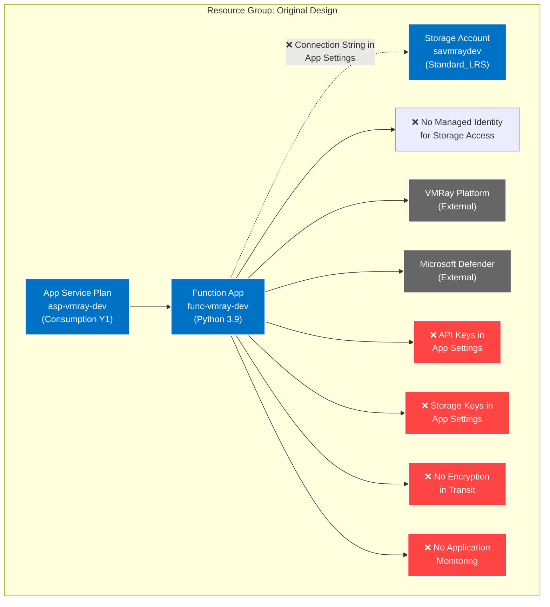

# Introduction

Implementation plan for deploying the VMRay Defender connector using Azure Function App with Flex Consumption Plan in the westus3 region. The infrastructure will be deployed to resource group `rg-vmray-sec-wus3-dev` with a focus on security, proper secret management, and Azure best practices.

## Architecture Comparison

### Original Vendor Design



### Security-Enhanced Design


### Key Security Improvements

1. **Storage Access Method**
   - ❌ Original: Connection string stored in application settings
   - ✅ Enhanced: Managed Identity with RBAC for storage access

2. **Secret Management**
   - ❌ Original: API keys stored in application settings
   - ✅ Enhanced: Centralized secret management in Key Vault with RBAC

2. **Network Security**
   - ❌ Original: Direct public access to resources
   - ✅ Enhanced: Private endpoints for all sensitive resources

3. **Identity Management**
   - ❌ Original: No managed identities
   - ✅ Enhanced: System-assigned managed identity with RBAC

4. **Monitoring**
   - ❌ Original: No application monitoring
   - ✅ Enhanced: Application Insights integration

5. **Data Protection**
   - ❌ Original: Basic storage security
   - ✅ Enhanced: Encryption at rest and in transit

6. **Key Rotation**
   - ❌ Original: Manual key management
   - ✅ Enhanced: Automated key rotation policies

## Current Architecture


## Resources

### Resource Group

```yaml
name: rg-vmray-sec-wus3-dev
kind: Raw
type: Microsoft.Resources/resourceGroups@2023-07-01

purpose: Contains all VMRay Defender connector resources
dependsOn: []

parameters:
  required:
    - name: location
      type: string
      description: Azure region
      example: westus3
    - name: tags
      type: object
      description: Resource tags
      example: {
        environment: dev,
        workload: security
      }

references:
  docs: https://learn.microsoft.com/azure/azure-resource-manager/management/manage-resource-groups-portal
```

### Key Vault

```yaml
name: kv-vmray-sec-wus3-dev
kind: AVM
avmModule: br/public:avm/res/key-vault/vault:1.0.0

purpose: Secure storage for VMRay API keys and function app secrets
dependsOn: []

parameters:
  required:
    - name: name
      type: string
      description: Key vault name
      example: kv-vmray-sec-wus3-dev
    - name: location
      type: string
      description: Azure region
      example: westus3
  optional:
    - name: enableRbacAuthorization
      type: bool
      description: Use RBAC for access control
      default: true
    - name: enableSoftDelete
      type: bool
      description: Enable soft delete protection
      default: true
    - name: softDeleteRetentionInDays
      type: int
      description: Soft delete retention period
      default: 90

security:
  encryption:
    atRest: enabled
    inTransit: enabled
  network:
    privateEndpoints:
      - subnetId: {vnetName}/subnets/{subnetName}
        groupIds: ['vault']
  monitoring:
    diagnosticSettings: enabled
    auditLogs: enabled

outputs:
  - name: keyVaultUri
    type: string
    description: URI for Key Vault
  - name: keyVaultId
    type: string
    description: Resource ID of Key Vault

references:
  docs: https://learn.microsoft.com/azure/key-vault/general/overview
  avm: https://github.com/Azure/bicep-registry-modules/tree/main/avm/res/key-vault/vault
```

### Storage Account

```yaml
name: savmraysecwus3dev
kind: AVM
avmModule: br/public:avm/res/storage/storage-account:1.0.0

purpose: Storage for Function App and VMRay evidence files
dependsOn: [kv-vmray-sec-wus3-dev]

parameters:
  required:
    - name: name
      type: string
      description: Storage account name
      example: savmraysecwus3dev
    - name: location
      type: string
      description: Azure region
      example: westus3
  optional:
    - name: sku
      type: string
      description: Storage account SKU
      default: Standard_LRS
    - name: kind
      type: string
      description: Storage account kind
      default: StorageV2

security:
  keyVault:
    reference: kv-vmray-sec-wus3-dev
    secrets:
      - name: StorageAccountKey
        description: Primary storage account access key
        rotation:
          policy: TimeAfter
          interval: P90D
  encryption:
    atRest: enabled
    inTransit: enabled
  identity:
    type: SystemAssigned
  network:
    privateEndpoints:
      - subnetId: {vnetName}/subnets/{subnetName}
        groupIds: ['blob', 'file', 'queue']
  monitoring:
    diagnosticSettings: enabled
    auditLogs: enabled

outputs:
  - name: storageAccountId
    type: string
    description: Resource ID of storage account
  - name: primaryEndpoints
    type: object
    description: Storage account endpoints

references:
  docs: https://learn.microsoft.com/azure/storage/common/storage-account-overview
  avm: https://github.com/Azure/bicep-registry-modules/tree/main/avm/res/storage/storage-account
```

### Application Insights

```yaml
name: appi-vmray-sec-wus3-dev
kind: AVM
avmModule: br/public:avm/res/insights/component:1.0.0

purpose: Application monitoring for Function App
dependsOn: []

parameters:
  required:
    - name: name
      type: string
      description: Application Insights name
      example: appi-vmray-sec-wus3-dev
    - name: location
      type: string
      description: Azure region
      example: westus3
    - name: kind
      type: string
      description: Type of application being monitored
      example: web

security:
  keyVault:
    reference: kv-vmray-sec-wus3-dev
    secrets:
      - name: ApplicationInsightsKey
        description: Instrumentation key
        rotation:
          policy: Manual
          interval: P365D
  monitoring:
    diagnosticSettings: enabled
    auditLogs: enabled

outputs:
  - name: instrumentationKey
    type: string
    description: Application Insights instrumentation key
  - name: connectionString
    type: string
    description: Application Insights connection string

references:
  docs: https://learn.microsoft.com/azure/azure-monitor/app/app-insights-overview
  avm: https://github.com/Azure/bicep-registry-modules/tree/main/avm/res/insights/component
```

### Function App Plan

```yaml
name: asp-vmray-sec-wus3-dev
kind: AVM
avmModule: br/public:avm/res/web/serverfarm:1.0.0

purpose: Hosting plan for Function App (Consumption)
dependsOn: []

parameters:
  required:
    - name: name
      type: string
      description: App service plan name
      example: asp-vmray-sec-wus3-dev
    - name: location
      type: string
      description: Azure region
      example: westus3
  optional:
    - name: sku
      type: object
      description: SKU for consumption plan
      default: {
        name: Y1,
        tier: Dynamic
      }

security:
  monitoring:
    diagnosticSettings: enabled
    auditLogs: enabled

outputs:
  - name: id
    type: string
    description: Resource ID of app service plan

references:
  docs: https://learn.microsoft.com/azure/azure-functions/functions-scale#consumption-plan
  avm: https://github.com/Azure/bicep-registry-modules/tree/main/avm/res/web/serverfarm
```

### Function App

```yaml
name: func-vmray-sec-wus3-dev
kind: AVM
avmModule: br/public:avm/res/web/site:1.0.0

purpose: VMRay Defender connector Function App
dependsOn: [asp-vmray-sec-wus3-dev, savmraysecwus3dev, appi-vmray-sec-wus3-dev, kv-vmray-sec-wus3-dev]

parameters:
  required:
    - name: name
      type: string
      description: Function app name
      example: func-vmray-sec-wus3-dev
    - name: location
      type: string
      description: Azure region
      example: westus3
    - name: serverFarmResourceId
      type: string
      description: App service plan ID
      example: {serverFarmResourceId}
  optional:
    - name: siteConfig
      type: object
      description: Function app configuration
      default: {
        pythonVersion: 3.9,
        ftpsState: FtpsOnly,
        minTlsVersion: 1.2
      }

security:
  keyVault:
    reference: kv-vmray-sec-wus3-dev
    secrets:
      - name: VmrayApiKey
        description: VMRay API authentication key
        rotation:
          policy: Manual
          interval: P365D
      - name: DefenderApiKey
        description: Microsoft Defender API key
        rotation:
          policy: Manual
          interval: P365D
    accessPolicies:
      - principalId: {functionAppManagedIdentity}
        permissions: [get, list]
  encryption:
    atRest: enabled
    inTransit: enabled
  identity:
    type: SystemAssigned
  network:
    privateEndpoints:
      - subnetId: {vnetName}/subnets/{subnetName}
        groupIds: ['sites']
  monitoring:
    diagnosticSettings: enabled
    auditLogs: enabled

outputs:
  - name: functionAppId
    type: string
    description: Resource ID of function app
  - name: defaultHostName
    type: string
    description: Default hostname of function app

references:
  docs: https://learn.microsoft.com/azure/azure-functions/functions-overview
  avm: https://github.com/Azure/bicep-registry-modules/tree/main/avm/res/web/site
```

# Implementation Plan

## Phase 0 — Documentation & Architecture

**Objective:** Create comprehensive architecture documentation

- IMPLEMENT-GOAL-000: Create detailed architecture documentation

| Task     | Description                                          | Action                                    |
|----------|------------------------------------------------------|-------------------------------------------|
| TASK-000 | Create architecture diagram                          | Create visual diagram showing:            |
|          |                                                      | - Resource relationships                  |
|          |                                                      | - Network connectivity                    |
|          |                                                      | - Security components                     |
|          |                                                      | - Integration points                      |

## Phase 1 — Base Infrastructure

**Objective:** Create resource group and security components

- IMPLEMENT-GOAL-001: Setup secure foundation with Key Vault and Storage

| Task     | Description                                          | Action                                    |
|----------|------------------------------------------------------|-------------------------------------------|
| TASK-001 | Create folder structure                              | Create bicep/subscriptions/DEV/           |
| TASK-002 | Create resource group                                | Add resource group definition             |
| TASK-003 | Implement Key Vault                                  | Add Key Vault with security configuration |
| TASK-004 | Implement Storage Account                            | Add Storage with private endpoints        |

## Phase 2 — Monitoring Setup

**Objective:** Implement monitoring infrastructure

- IMPLEMENT-GOAL-002: Configure application monitoring

| Task     | Description                                          | Action                                    |
|----------|------------------------------------------------------|-------------------------------------------|
| TASK-005 | Implement Application Insights                       | Add Application Insights resource         |
| TASK-006 | Configure diagnostic settings                        | Add diagnostic settings for all resources |

## Phase 3 — Function App Deployment

**Objective:** Deploy Function App infrastructure

- IMPLEMENT-GOAL-003: Setup Function App with proper configuration

| Task     | Description                                          | Action                                    |
|----------|------------------------------------------------------|-------------------------------------------|
| TASK-007 | Implement Function App Plan                          | Add consumption plan definition           |
| TASK-008 | Implement Function App                               | Add Function App with security settings   |
| TASK-009 | Configure app settings                               | Add secure app settings configuration     |

## Phase 4 — Source Code Security Updates

**Objective:** Update Python source code to leverage security enhancements

- IMPLEMENT-GOAL-004: Modify source code to use secure authentication and access patterns

| Task     | Description                                          | Action                                    |
|----------|------------------------------------------------------|-------------------------------------------|
| TASK-010 | Update storage access method                         | - Replace connection string usage         |
|          |                                                      | - Implement DefaultAzureCredential        |
|          |                                                      | - Use managed identity for blob access    |
| TASK-011 | Implement Key Vault integration                      | - Add Key Vault client configuration     |
|          |                                                      | - Use managed identity for secrets       |
|          |                                                      | - Implement secret caching               |
| TASK-012 | Update external API authentication                   | - Retrieve API keys from Key Vault       |
|          |                                                      | - Implement retry with backoff           |
|          |                                                      | - Add proper error handling             |
| TASK-013 | Add application monitoring                          | - Configure App Insights logging         |
|          |                                                      | - Add correlation IDs                    |
|          |                                                      | - Implement proper exception tracking    |
| TASK-014 | Implement secure configuration                      | - Remove hardcoded credentials          |
|          |                                                      | - Use environment variables for configs  |
|          |                                                      | - Implement configuration validation     |

Code modifications will focus on these files:
- `/Source/VMRayDefender/lib/VMRay.py` - Update VMRay API client
- `/Source/VMRayDefender/lib/MicrosoftDefender.py` - Update Defender integration
- `/Source/VMRayDefender/connector.py` - Update main connector logic
- `/Source/host.json` - Add App Insights configuration

### Required Code Changes

#### 1. Storage Access Updates (`connector.py`)
```python
from azure.identity import DefaultAzureCredential
from azure.storage.blob import BlobServiceClient
from azure.core.exceptions import ResourceNotFoundError
from functools import lru_cache

class SecureConnector:
    def __init__(self):
        self.credential = DefaultAzureCredential()
        
    @lru_cache(maxsize=1)
    def get_blob_service_client(self):
        """Get blob service client using managed identity"""
        account_url = f"https://{self.storage_account_name}.blob.core.windows.net"
        return BlobServiceClient(
            account_url=account_url,
            credential=self.credential
        )

    async def upload_evidence(self, container_name: str, blob_name: str, data: bytes):
        """Upload evidence using managed identity"""
        try:
            blob_service_client = self.get_blob_service_client()
            container_client = blob_service_client.get_container_client(container_name)
            blob_client = container_client.get_blob_client(blob_name)
            
            await blob_client.upload_blob(data, overwrite=True)
        except ResourceNotFoundError as e:
            self.logger.error(f"Failed to upload evidence: {e}")
            raise
```

#### 2. Key Vault Integration (`lib/secure_config.py`)
```python
from azure.identity import DefaultAzureCredential
from azure.keyvault.secrets import SecretClient
from functools import lru_cache
import logging

class SecureConfig:
    def __init__(self):
        self.logger = logging.getLogger(__name__)
        self.credential = DefaultAzureCredential()
        self.vault_url = f"https://{self.key_vault_name}.vault.azure.net"
        self._secret_client = None

    @property
    @lru_cache(maxsize=1)
    def secret_client(self):
        """Cached Key Vault client using managed identity"""
        if not self._secret_client:
            self._secret_client = SecretClient(
                vault_url=self.vault_url,
                credential=self.credential
            )
        return self._secret_client

    async def get_secret(self, secret_name: str) -> str:
        """Get secret from Key Vault with caching"""
        try:
            secret = await self.secret_client.get_secret(secret_name)
            return secret.value
        except Exception as e:
            self.logger.error(f"Failed to retrieve secret {secret_name}: {e}")
            raise
```

#### 3. VMRay API Client Updates (`lib/VMRay.py`)
```python
from azure.identity import DefaultAzureCredential
from azure.keyvault.secrets import SecretClient
from typing import Optional
import aiohttp
import backoff

class VMRayClient:
    def __init__(self, config: SecureConfig):
        self.config = config
        self.logger = logging.getLogger(__name__)
        self._api_key = None

    @property
    @lru_cache(maxsize=1)
    async def api_key(self) -> str:
        """Get VMRay API key from Key Vault"""
        if not self._api_key:
            self._api_key = await self.config.get_secret("VmrayApiKey")
        return self._api_key

    @backoff.on_exception(
        backoff.expo,
        (aiohttp.ClientError, TimeoutError),
        max_tries=3
    )
    async def submit_sample(self, file_content: bytes) -> dict:
        """Submit sample with retry logic and proper error handling"""
        try:
            api_key = await self.api_key
            headers = {
                "Authorization": f"api_key {api_key}",
                "Content-Type": "application/octet-stream"
            }
            
            async with aiohttp.ClientSession() as session:
                async with session.post(
                    f"{self.api_url}/rest/sample/submit",
                    headers=headers,
                    data=file_content
                ) as response:
                    response.raise_for_status()
                    return await response.json()
                    
        except Exception as e:
            self.logger.error(f"Failed to submit sample: {e}")
            raise
```

#### 4. Defender Integration Updates (`lib/MicrosoftDefender.py`)
```python
from azure.identity import DefaultAzureCredential
from azure.keyvault.secrets import SecretClient
import aiohttp
import backoff

class DefenderClient:
    def __init__(self, config: SecureConfig):
        self.config = config
        self.logger = logging.getLogger(__name__)
        self._api_key = None

    @property
    @lru_cache(maxsize=1)
    async def api_key(self) -> str:
        """Get Defender API key from Key Vault"""
        if not self._api_key:
            self._api_key = await self.config.get_secret("DefenderApiKey")
        return self._api_key

    @backoff.on_exception(
        backoff.expo,
        (aiohttp.ClientError, TimeoutError),
        max_tries=3
    )
    async def submit_indicator(self, indicator_data: dict) -> dict:
        """Submit indicator with retry logic"""
        try:
            api_key = await self.api_key
            headers = {
                "Authorization": f"Bearer {api_key}",
                "Content-Type": "application/json"
            }
            
            async with aiohttp.ClientSession() as session:
                async with session.post(
                    f"{self.api_url}/api/indicators",
                    headers=headers,
                    json=indicator_data
                ) as response:
                    response.raise_for_status()
                    return await response.json()
                    
        except Exception as e:
            self.logger.error(f"Failed to submit indicator: {e}")
            raise
```

#### 5. Application Monitoring (`host.json`)
```json
{
    "version": "2.0",
    "logging": {
        "applicationInsights": {
            "samplingSettings": {
                "isEnabled": true,
                "excludedTypes": "Request"
            },
            "enableLiveMetrics": true,
            "enableDependencyTracking": true,
            "enablePerformanceCountersCollection": true,
            "httpAutoCollectionOptions": {
                "enableHttpTriggerExtendedInfoCollection": true,
                "enableW3CDistributedTracing": true,
                "enableResponseHeaderInjection": true
            }
        }
    },
    "extensionBundle": {
        "id": "Microsoft.Azure.Functions.ExtensionBundle",
        "version": "[3.*, 4.0.0)"
    }
}
```

#### 6. Main Function Updates (`VMRayDefender/__init__.py`)
```python
import logging
import azure.functions as func
from opencensus.extension.azure.functions import OpenCensusExtension
from .lib.secure_config import SecureConfig
from .lib.VMRay import VMRayClient
from .lib.MicrosoftDefender import DefenderClient

# Initialize OpenCensus for Azure Functions
OpenCensusExtension.configure()

async def main(req: func.HttpRequest) -> func.HttpResponse:
    # Get correlation ID for request tracking
    correlation_id = req.headers.get('x-correlation-id', str(uuid.uuid4()))
    logger = logging.getLogger(__name__)
    
    try:
        # Initialize secure configuration
        config = SecureConfig()
        
        # Initialize clients with secure config
        vmray_client = VMRayClient(config)
        defender_client = DefenderClient(config)
        
        # Process request with correlation tracking
        with logger.correlation_context(correlation_id=correlation_id):
            # Your processing logic here
            pass
            
    except Exception as e:
        logger.exception(f"Error processing request: {e}")
        return func.HttpResponse(
            f"Error: {str(e)}",
            status_code=500
        )
```

### Package Dependencies (`requirements.txt`)
```text
azure-identity>=1.12.0
azure-keyvault-secrets>=4.7.0
azure-storage-blob>=12.16.0
azure-functions>=1.15.0
opencensus-extension-azure>=1.1.9
backoff>=2.2.1
aiohttp>=3.8.5
```

## High-level design

The implementation follows a secure-by-default approach:
- All resources deployed to westus3 region in resource group `rg-vmray-sec-wus3-dev`
- Key Vault as central secret store with RBAC authorization
- Storage Account with private endpoints for Function App
- Application Insights for monitoring
- Function App with managed identity and Key Vault integration
- All sensitive configuration stored in Key Vault
- Network isolation using private endpoints
- Diagnostic settings enabled across all resources