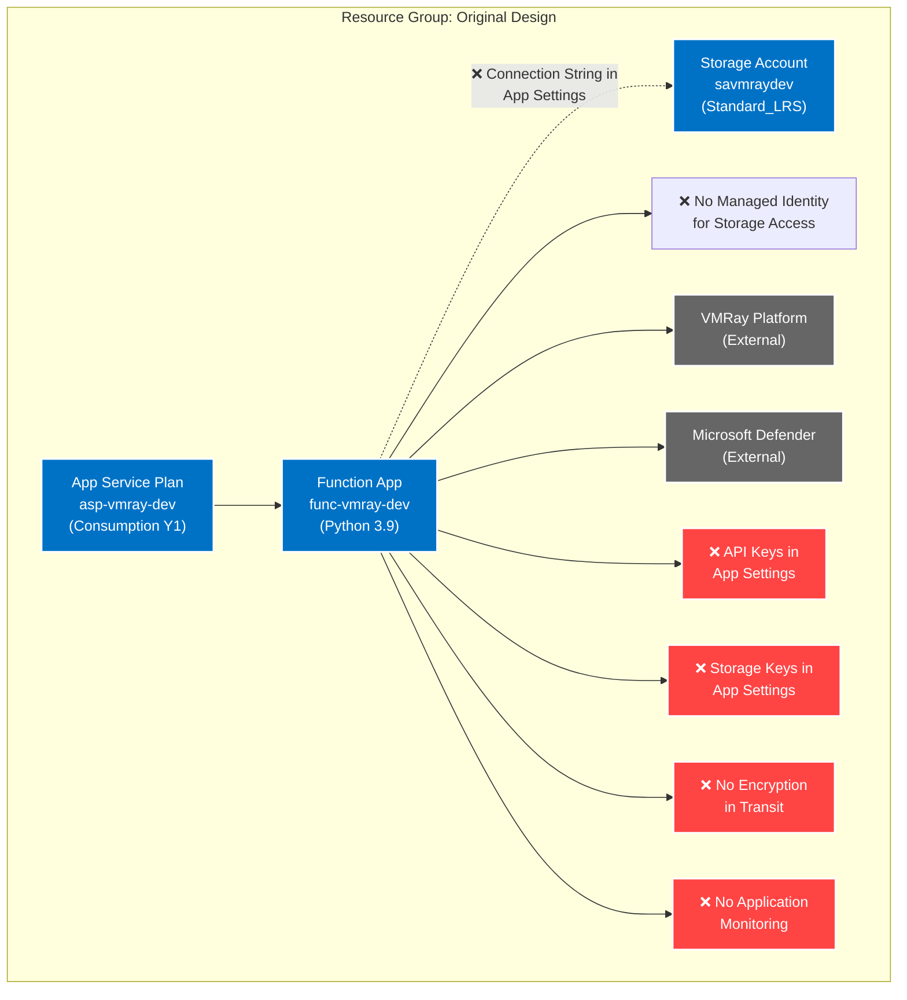
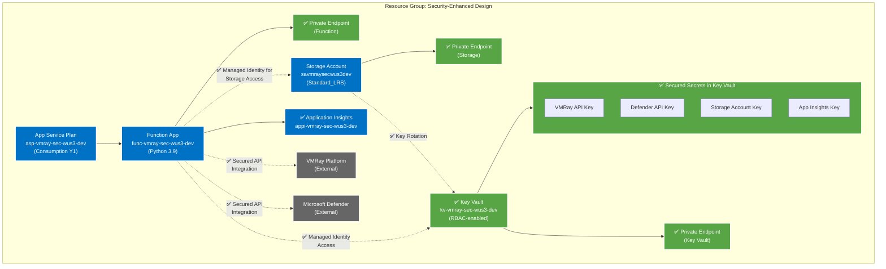

# VMRay Defender Architecture Review

## Executive Summary

This document outlines the architectural review of the VMRay Defender connector implementation, comparing the original vendor design with our enhanced secure architecture. The review focuses on security improvements, operational efficiency, and compliance with Azure best practices.

## Architecture Comparison

### Original Vendor Design

### Enhanced Secure Design

## Key Differences Highlighted

1. **Storage Access Method**
   - ❌ Original: Connection string stored in application settings
   - ✅ Enhanced: Managed Identity with RBAC for storage access

2. **Secret Management**
   - ❌ Original: API keys stored in application settings
   - ✅ Enhanced: Centralized secret management in Key Vault with RBAC

3. **Network Security**
   - ❌ Original: Direct public access to resources
   - ✅ Enhanced: Private endpoints for all sensitive resources

4. **Identity Management**
   - ❌ Original: No managed identities
   - ✅ Enhanced: System-assigned managed identity with RBAC

5. **Monitoring**
   - ❌ Original: No application monitoring
   - ✅ Enhanced: Application Insights integration

6. **Data Protection**
   - ❌ Original: Basic storage security
   - ✅ Enhanced: Encryption at rest and in transit

7. **Key Rotation**
   - ❌ Original: Manual key management
   - ✅ Enhanced: Automated key rotation policies

## Current State Analysis

### Original Implementation Challenges

1. **Security Concerns**
   - Connection strings and API keys stored in application settings
   - Direct public access to Azure resources
   - No managed identity implementation
   - Lack of centralized secret management
   - No encryption in transit enforcement
   - Absence of application monitoring

2. **Operational Risks**
   - Manual key rotation process
   - No standardized logging or monitoring
   - Limited ability to audit access
   - Potential for credential exposure
   - No network isolation

3. **Compliance Gaps**
   - Missing encryption requirements
   - Inadequate secret management
   - Limited audit capabilities
   - No clear security boundaries

## Enhanced Architecture Benefits

### Security Improvements

1. **Identity and Access Management**
   - System-assigned managed identities for authentication
   - RBAC-based access control
   - Elimination of connection strings in code
   - Centralized secret management in Key Vault

2. **Network Security**
   - Private endpoints for all sensitive resources
   - Network isolation through virtual networks
   - Encrypted communication channels
   - Controlled access points

3. **Data Protection**
   - Encryption at rest and in transit
   - Automated key rotation
   - Secure secret storage
   - Proper credential management

4. **Monitoring and Auditing**
   - Application Insights integration
   - Comprehensive logging
   - Diagnostic settings enabled
   - Performance monitoring

## Implementation Strategy

### Phase 1: Infrastructure Updates

1. **Resource Deployment**
   - Create new resource group
   - Deploy Key Vault with RBAC
   - Configure storage account with private endpoints
   - Set up Application Insights

2. **Security Configuration**
   - Enable managed identities
   - Configure RBAC permissions
   - Set up private endpoints
   - Implement diagnostic settings

### Phase 2: Application Updates

1. **Code Modifications**
   - Update authentication methods
   - Implement Key Vault integration
   - Add application monitoring
   - Enhance error handling

2. **Configuration Changes**
   - Move secrets to Key Vault
   - Update application settings
   - Configure logging
   - Implement correlation tracking

## Risk Mitigation

### Deployment Risks

1. **Service Interruption**
   - Deploy during maintenance window
   - Maintain parallel environments
   - Have rollback plan ready
   - Test in lower environments

2. **Authentication Issues**
   - Pre-configure managed identities
   - Validate RBAC assignments
   - Test access patterns
   - Document fallback procedures

### Operational Risks

1. **Performance Impact**
   - Monitor application metrics
   - Set up alerts
   - Establish baselines
   - Configure auto-scaling

2. **Access Management**
   - Document RBAC assignments
   - Regular access reviews
   - Monitoring of privilege usage
   - Automated compliance checks

## Timeline and Resources

### Estimated Timeline

1. **Infrastructure Updates: 2 Weeks**
   - Resource deployment: 3 days
   - Security configuration: 4 days
   - Testing and validation: 5 days
   - Documentation: 2 days

2. **Application Updates: 3 Weeks**
   - Code modifications: 8 days
   - Testing: 5 days
   - Security review: 2 days
   - Performance testing: 3 days
   - Final documentation: 2 days

### Required Resources

1. **Personnel**
   - 1 Cloud Architect
   - 2 Senior Developers
   - 1 Security Engineer
   - 1 DevOps Engineer

2. **Tools and Access**
   - Azure subscription access
   - Development environments
   - Testing environments
   - Monitoring tools

## Success Criteria

1. **Security**
   - All secrets stored in Key Vault
   - No exposed connection strings
   - Private endpoint connectivity
   - Managed identity authentication

2. **Performance**
   - Response times within SLA
   - No degradation from security changes
   - Successful load testing
   - Monitoring in place

3. **Compliance**
   - All security requirements met
   - Audit logging enabled
   - Documentation complete
   - Access reviews established

## Recommendation

Based on the security improvements, operational benefits, and risk mitigation strategies, we recommend proceeding with the enhanced architecture implementation. The initial investment in security and proper configuration will provide long-term benefits in security, maintainability, and compliance.

## Next Steps

1. Secure required approvals
2. Schedule implementation kickoff
3. Begin infrastructure deployment
4. Coordinate application updates
5. Plan testing and validation
6. Prepare production deployment